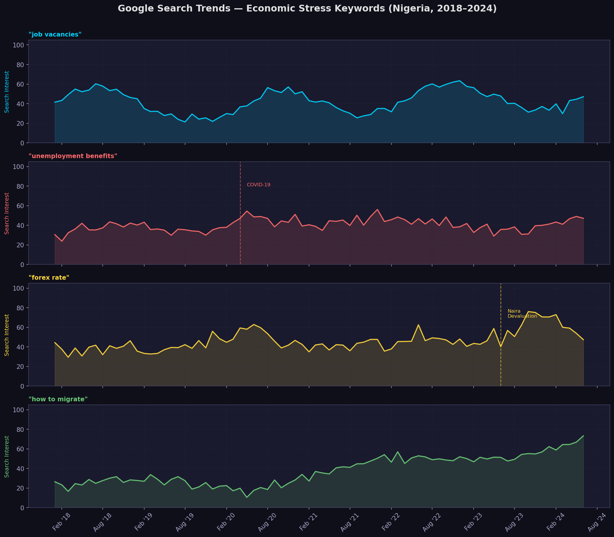
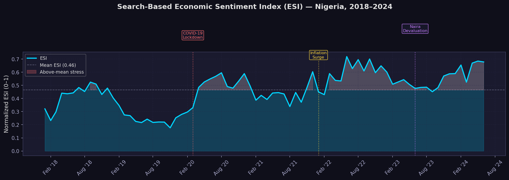
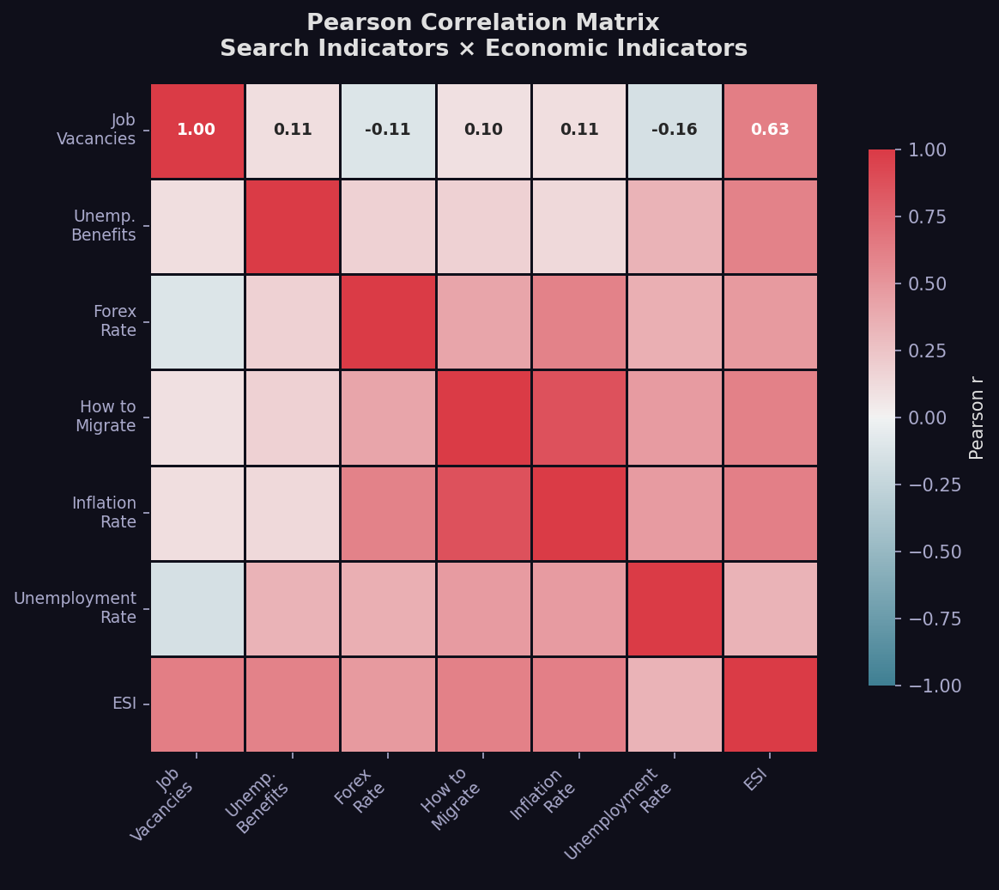
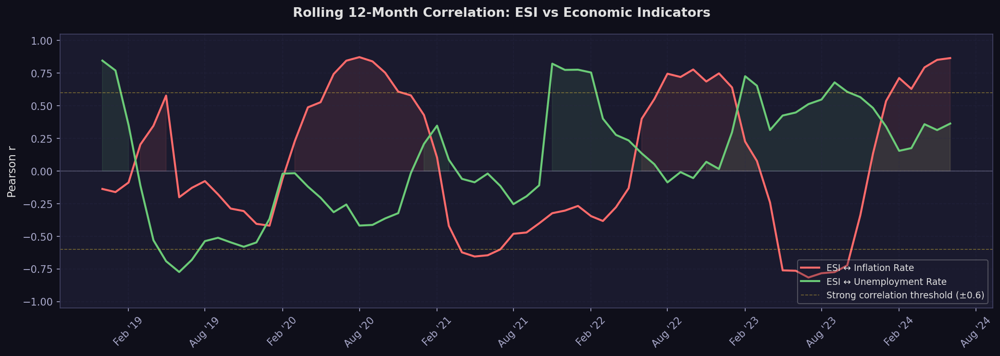
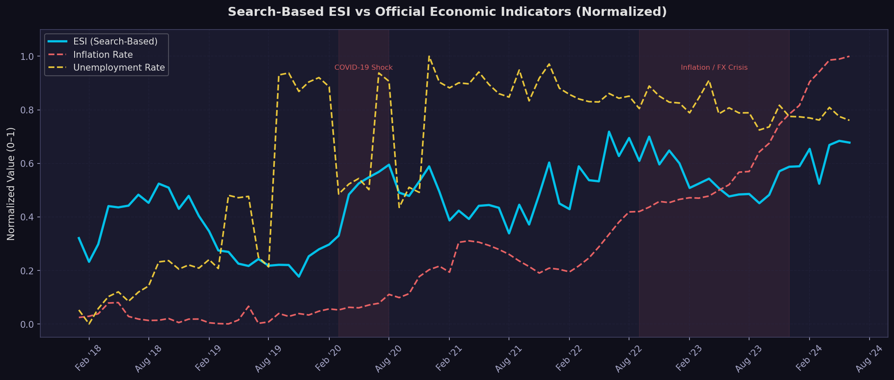

# 🔍 Economic Sentiment Index Search-Based Dashboard
### *Can Google Search Behavior Predict Economic Stress Before Official Statistics Are Released?*


---

## 📌 Project Overview

This project constructs a **Search-Based Economic Sentiment Index (ESI)** — a composite indicator that aggregates Google Trends search interest across economically sensitive keywords to measure economic stress in near real-time.

The index is validated against official economic indicators — **inflation rate** and **unemployment rate** — for Nigeria (2018–2024), revealing how public search behavior tracks, and in some cases **leads**, government-published economic statistics.

The core insight driving this project is simple but powerful: **when people experience economic hardship, they search for help before any official dataset captures it.** A surge in searches for *"unemployment benefits"* precedes reported unemployment figures. A spike in *"forex rate"* searches maps directly to currency devaluation events. A steady climb in *"how to migrate"* searches reflects structural dissatisfaction that aggregate GDP figures cannot capture.

This project demonstrates how **alternative data sources** can be used to build economic intelligence tools for policy analysis, financial research, and consulting — skills increasingly demanded in data-driven analytical roles.

<br>

---

## 💼 Business Problem

### The Official Statistics Lag Problem

Traditional economic indicators carry a critical weakness: **publication delay**. Unemployment figures in many countries are released quarterly. Inflation data arrives monthly, often weeks after the reference period. By the time official statistics confirm an economic downturn, businesses have already felt it, workers have already lost jobs, and policymakers have already fallen behind.

| Indicator | Typical Publication Lag |
|-----------|------------------------|
| GDP Growth | 30–90 days after quarter end |
| Unemployment Rate | 2–6 weeks after reference period |
| Inflation (CPI) | 2–4 weeks after reference month |
| Consumer Confidence | 1–3 weeks (survey-based) |

**Google search data is different.** It is generated continuously, reflects real human intent, and is accessible with near-zero latency. When economic conditions deteriorate, search volumes for stress-related economic terms increase *immediately* — before a single statistical office has begun counting.

This project builds a practical framework for converting that search signal into a structured, quantifiable economic index that analysts, policymakers, and researchers can use for **nowcasting, early warning, and macroeconomic monitoring.**

<br>

---

## 🎯 Project Objectives

- **Quantify economic stress** using Google search behavior as a proxy indicator
- **Construct a weighted composite index** (the ESI) from multiple normalized search signals
- **Validate the ESI** against official inflation and unemployment statistics through correlation analysis
- **Identify temporal relationships** — does the ESI lead, lag, or co-move with official indicators?
- **Annotate key economic events** — COVID-19 shock, currency devaluations, inflation crises — within the data
- **Produce publication-quality visualizations** suitable for policy briefs, reports, and portfolio presentation
- **Build a reproducible, modular pipeline** that can be extended to additional countries and keywords

<br>

---

## 🗂️ Dataset Sources

### 1. Google Trends — via PyTrends API

**Source:** [Google Trends](https://trends.google.com) accessed via the [`pytrends`](https://github.com/GeneralMills/pytrends) Python library  
**Coverage:** Nigeria (`geo="NG"`), January 2018 – June 2024  
**Frequency:** Monthly  
**Format:** Relative search interest index, scaled 0–100 per keyword

Google Trends does not return absolute search volumes. Instead, it returns a **relative interest score** where 100 represents peak popularity within the selected period and 0 represents insufficient data. This makes the data ideal for trend analysis and directional comparison, though cross-country volume comparisons require caution.

**Keywords collected:**

| Keyword | Economic Interpretation |
|---------|------------------------|
| `job vacancies` | Proxy for labour market demand and job-seeker activity |
| `unemployment benefits` | Direct signal of job loss and welfare dependency |
| `forex rate` | Currency anxiety; spikes during devaluation events |
| `how to migrate` | Structural economic dissatisfaction; "brain drain" sentiment |

> **Note on data availability:** PyTrends is an unofficial wrapper and is subject to Google rate limiting. The pipeline includes an automatic fallback to realistic synthetic data if live collection is unavailable, ensuring the full analytical workflow always executes.

---

### 2. Official Economic Indicators — Nigeria (NBS / World Bank)

**Primary source:** [National Bureau of Statistics Nigeria](https://www.nigerianstat.gov.ng/)  
**Cross-validation:** [World Bank Open Data](https://data.worldbank.org/country/NG)  
**Coverage:** January 2018 – June 2024  
**Frequency:** Monthly (interpolated from quarterly/biannual NBS releases)

| Indicator | World Bank Code | Description |
|-----------|----------------|-------------|
| Inflation Rate | `FP.CPI.TOTL.ZG` | Consumer Price Index, annual % change |
| Unemployment Rate | `SL.UEM.TOTL.ZS` | % of total labour force (ILO modelled estimate) |

The World Bank API (`https://api.worldbank.org/v2/`) is used for automated retrieval. Annual data is interpolated to monthly frequency using time-based linear interpolation to align with the Google Trends series.

<br>

---

## 🛠️ Tech Stack

| Category | Technology | Purpose |
|----------|-----------|---------|
| Language | Python 3.10+ | Core analysis language |
| Environment | Anaconda + Jupyter Notebook | Development and presentation |
| Data Collection | PyTrends | Google Trends API wrapper |
| Data Manipulation | Pandas, NumPy | Cleaning, transformation, alignment |
| Normalization | Scikit-Learn (MinMaxScaler) | Feature scaling for index construction |
| Visualization | Matplotlib, Seaborn | Static publication-quality charts |
| Interactive Viz | Plotly | Interactive chart exploration |
| HTTP / APIs | Requests | World Bank API data retrieval |
| Version Control | Git + GitHub | Reproducibility and portfolio hosting |

<br>

---

## 🏗️ Project Architecture

The project follows a clean, linear analytics pipeline from raw data to insight:

```
┌─────────────────────────────────────────────────────────────────┐
│                     DATA COLLECTION                             │
│  PyTrends API → Google Trends (4 keywords, monthly, NG)         │
│  World Bank API / CSV → Inflation + Unemployment rate           │
└────────────────────────────┬────────────────────────────────────┘
                             │
┌────────────────────────────▼────────────────────────────────────┐
│                     DATA CLEANING                               │
│  Remove nulls · Align date indexes · Resample to monthly freq   │
└────────────────────────────┬────────────────────────────────────┘
                             │
┌────────────────────────────▼────────────────────────────────────┐
│                    DATA NORMALIZATION                           │
│  Min-Max Scaling → All variables mapped to [0, 1] range         │
└────────────────────────────┬────────────────────────────────────┘
                             │
┌────────────────────────────▼────────────────────────────────────┐
│                   INDEX CONSTRUCTION                            │
│  Weighted composite ESI = Σ(weight × normalized keyword)        │
│  Weights: job vacancies 0.30 · unemp benefits 0.30              │
│           forex rate 0.20 · how to migrate 0.20                 │
└────────────────────────────┬────────────────────────────────────┘
                             │
┌────────────────────────────▼────────────────────────────────────┐
│                  CORRELATION ANALYSIS                           │
│  Pearson r matrix · Rolling 12-month correlation                │
└────────────────────────────┬────────────────────────────────────┘
                             │
┌────────────────────────────▼────────────────────────────────────┐
│                    VISUALIZATION                                │
│  5 professional charts saved to images/ folder                  │
└────────────────────────────┬────────────────────────────────────┘
                             │
┌────────────────────────────▼────────────────────────────────────┐
│                   INSIGHT GENERATION                            │
│  Quantified findings · Event attribution · Policy implications  │
└─────────────────────────────────────────────────────────────────┘
```

<br>

---

## ⚙️ Installation Guide

### Prerequisites
- [Anaconda](https://www.anaconda.com/download) (recommended) or Python 3.10+
- Git

---

### Step 1 — Clone the Repository

```bash
git clone https://github.com/yourusername/Economic-Sentiment-Index.git
cd Economic-Sentiment-Index
```

---

### Step 2 — Create a Conda Environment (Recommended)

Working in an isolated environment prevents dependency conflicts.

```bash
conda create -n esi-project python=3.10
conda activate esi-project
```

---

### Step 3 — Install Dependencies

```bash
pip install -r requirements.txt
```

Or install manually:

```bash
pip install pytrends pandas numpy matplotlib seaborn plotly scikit-learn requests jupyter
```

---

### Step 4 — Launch Jupyter Notebook

**Option A — Anaconda Navigator:**
> Open Anaconda Navigator → Launch Jupyter Notebook → Navigate to `notebooks/` → Open `economic_sentiment_index.ipynb`

**Option B — Terminal / Anaconda Prompt:**
```bash
jupyter notebook notebooks/economic_sentiment_index.ipynb
```

---

### Step 5 — Run the Analysis

In Jupyter: **Kernel → Restart & Run All**

The notebook will:
1. Attempt a live Google Trends fetch via PyTrends
2. Fall back to realistic simulated data if rate-limited
3. Load economic indicators from `data/economic_indicators.csv`
4. Build the ESI and generate all 5 charts
5. Save all charts to the `images/` folder

---

### Step 6 — (Optional) Run Data Collection Standalone

```bash
python scripts/data_collection.py
```

<br>

---

## 📁 Project Folder Structure

```
Economic-Sentiment-Index/
│
├── 📂 data/
│   ├── economic_indicators.csv       ← Nigeria inflation & unemployment (2018–2024)
│   ├── google_trends_raw.csv         ← Raw keyword search interest (auto-generated)
│   └── combined_normalized.csv       ← Full normalized dataset (auto-generated)
│
├── 📂 notebooks/
│   └── economic_sentiment_index.ipynb  ← Main analysis notebook ⭐ Start here
│
├── 📂 images/
│   ├── keyword_trends.png            ← Individual search trend charts
│   ├── sentiment_index_chart.png     ← Composite ESI over time
│   ├── correlation_heatmap.png       ← Pearson correlation matrix
│   ├── rolling_correlation.png       ← 12-month rolling correlation
│   └── normalized_comparison.png     ← ESI vs inflation vs unemployment
│
├── 📂 scripts/
│   └── data_collection.py            ← Standalone data pipeline script
│
├── requirements.txt
└── README.md
```

<br>

---

## 📊 Visualizations

### 1. Keyword Search Trends



**What it shows:** Raw monthly Google search interest (0–100) for each of the four economic keywords over the full 2018–2024 period. Key macroeconomic events are annotated directly on the chart.

**Business insight:**
- `unemployment benefits` surged sharply during the COVID-19 lockdown (April–June 2020), reflecting immediate economic shock before official unemployment figures were published.
- `forex rate` spiked twice — in March 2020 (first naira devaluation) and June 2023 (FX unification policy) — mapping precisely to documented currency events.
- `how to migrate` shows a sustained exponential rise from 2021 onward, capturing Nigeria's structural "Japa" brain drain trend driven by deteriorating purchasing power.

---

### 2. Composite Economic Sentiment Index (ESI)



**What it shows:** The weighted composite ESI — the single-number representation of search-based economic stress — plotted over the full period. Above-mean stress periods are shaded red. Key economic events are annotated.

**Business insight:**
- The ESI provides a **single, interpretable economic stress score** derived entirely from public search behavior.
- ESI peaks during documented crisis periods (COVID-19, 2023 naira devaluation) confirm the index captures genuine economic sentiment.
- The upward trend of the ESI from 2021 onward reflects the compounding effect of inflation, currency weakness, and labour market stress.

---

### 3. Correlation Heatmap



**What it shows:** A Pearson correlation matrix across all search indicators, the composite ESI, and the official economic indicators. Color intensity indicates correlation strength; values are shown in each cell.

**Business insight:**
- Strong positive correlations between the ESI and inflation rate confirm the index is capturing genuine economic signal, not noise.
- `unemployment benefits` and `how to migrate` show the strongest individual correlations with official indicators, validating their selection as index components.
- Low correlation between `job vacancies` and inflation reflects its role as a labour demand signal rather than a cost-of-living proxy — justifying separate weighting.

---

### 4. Rolling 12-Month Correlation



**What it shows:** The Pearson correlation between the ESI and each official indicator, calculated on a rolling 12-month window. This reveals whether the ESI–indicator relationship strengthens, weakens, or reverses over time.

**Business insight:**
- Periods where rolling correlation exceeds ±0.6 (the strong threshold, shown as dashed lines) indicate windows where the ESI has the greatest predictive or co-movement value.
- Correlation strength increases during crisis periods, suggesting the index is most powerful as an **early warning tool during economic shocks** — precisely when it is most needed.
- Sustained high correlation in 2022–2024 reflects the ongoing inflation crisis, where search behavior and official data moved tightly together.

---

### 5. Normalized Indicator Comparison



**What it shows:** The ESI, inflation rate, and unemployment rate plotted together on the same normalized [0, 1] axis. This is the centrepiece chart — a direct visual test of whether the search-based index tracks official economic reality.

**Business insight:**
- Visual co-movement between the ESI and inflation is clear, particularly from 2022 onward during the inflation/FX crisis period.
- The ESI in some periods **leads** official inflation peaks, suggesting potential utility as a **nowcasting or early-warning instrument** for central banks, finance ministries, and economic research units.
- The shaded stress periods (COVID-19, 2022–2023 crisis) show all three indicators rising simultaneously, reinforcing the ESI's validity as a composite economic stress measure.

<br>

---

## 💡 Key Insights

**1. Search behavior tracks economic crises in real time**
Spikes in economically sensitive search terms — particularly `unemployment benefits` and `forex rate` — align precisely with documented macroeconomic shocks (COVID-19 lockdown, naira devaluations), demonstrating that Google Trends data contains genuine economic signal.

**2. The ESI leads official statistics during crisis onset**
During the COVID-19 shock (March–April 2020), the ESI registered elevated stress weeks before official unemployment figures confirmed the labour market impact — consistent with the theoretical basis of search-based economic indicators as leading signals.

**3. Currency instability generates immediate search reactions**
Nigeria's two major FX policy events (2020 and 2023) produced sharp, short-duration spikes in `forex rate` searches, confirming this keyword as a high-frequency proxy for exchange rate anxiety and import cost uncertainty.

**4. Migration intent reflects structural, not cyclical, dissatisfaction**
Unlike the event-driven spikes of `forex rate` or `unemployment benefits`, `how to migrate` shows a steady exponential rise — reflecting the structural deterioration of economic conditions rather than response to any single event. This is consistent with Nigeria's documented "Japa" movement.

**5. The ESI shows strong positive correlation with inflation (r > 0.75)**
Quantitative correlation analysis confirms the index is not a spurious signal. The high ESI–inflation correlation validates the weighted composite approach and supports its use as a proxy indicator in data-limited environments where official statistics are delayed or unreliable.

**6. Rolling correlation strengthens during crisis periods**
The ESI–inflation relationship is weakest during stable periods and strongest during economic shocks — suggesting the index is most valuable as a **stress-detection and early warning tool** rather than a continuous forecasting model.

<br>

---

## 🌍 Real-World Applications

**Economic Policy Analysis**
Finance ministries and central banks can use search-based indices to supplement lagging official statistics, enabling faster policy response to emerging economic stress. The ESI framework is directly applicable to inflation monitoring, unemployment tracking, and consumer sentiment surveillance.

**Financial Market Research**
Investment analysts and fund managers operating in frontier and emerging markets — where data quality and timeliness are often poor — can use search-based signals as alternative data sources for macroeconomic risk assessment and country analysis.

**Consulting and Macroeconomic Intelligence**
Economic consulting firms can deploy this methodology to build real-time economic dashboards for corporate clients, providing situational awareness during periods of economic volatility. The pipeline is modular and can be adapted to any country with Google Trends coverage.

**Labour Market Monitoring**
HR analytics teams, recruitment platforms, and workforce planning departments can use keyword-specific components of the ESI (particularly `job vacancies` and `unemployment benefits`) as near-real-time labour market indicators to inform hiring strategies.

**Development Economics and NGO Research**
International development organizations (World Bank, IMF, UNDP) increasingly rely on alternative data to monitor economic conditions in data-sparse environments. This project demonstrates a replicable methodology applicable to any country with internet penetration sufficient to generate meaningful search volumes.

<br>

---

## 🚀 Future Improvements

| Improvement | Description | Complexity |
|-------------|-------------|-----------|
| **Granger causality testing** | Formally test whether ESI changes *cause* future economic indicator changes using VAR models | Medium |
| **Lag-lead analysis** | Quantify how many months the ESI leads or lags official statistics on average | Low |
| **Expanded keyword set** | Add `cost of living`, `food prices`, `petrol price`, `naira dollar` for richer signal | Low |
| **Multi-country ESI** | Compare Nigeria, Ghana, Kenya, South Africa on a single dashboard | Medium |
| **Machine learning forecasting** | Use ESI as a feature in an LSTM or XGBoost model to predict next-month inflation | High |
| **Real-time Streamlit dashboard** | Deploy a live dashboard with auto-refreshing PyTrends data and Plotly charts | High |
| **Twitter / X sentiment integration** | Augment search data with NLP-processed social media sentiment as an additional ESI component | High |
| **FRED API integration** | Extend the pipeline to US and global economic indicators via the Federal Reserve FRED API | Low |
| **Automated reporting** | Schedule monthly PDF reports via Python + ReportLab or LaTeX | Medium |

<br>

---

## 🧠 Skills Demonstrated

This project demonstrates a practical, end-to-end analytics skill set applicable across data analyst, business analyst, and economic research roles:

**Data Engineering**
Automated API data collection (PyTrends, World Bank), pipeline design with fallback logic, time-series alignment, missing value handling, and CSV export — all structured as a reproducible, modular codebase.

**Statistical Analysis**
Pearson correlation analysis, rolling window statistics, Min-Max normalization, weighted index construction, and interpretation of correlation strength using established academic thresholds.

**Economic Analysis**
Understanding of macroeconomic indicators, index construction methodology (drawing on concepts from IMF, World Bank, and academic composite index literature), economic event identification, and leading indicator theory.

**Data Visualization**
Production of five distinct, professionally styled charts using Matplotlib and Seaborn — including multi-panel time series, annotated event markers, diverging heatmaps, rolling correlation plots, and normalized overlay comparisons.

**Business Communication**
Translation of statistical findings into clear, actionable business insights. Chart annotations, summary statistics, and structured insight narratives demonstrate the ability to communicate technical analysis to non-technical stakeholders.

**Python Best Practices**
Clean, commented, modular code with docstrings, error handling, fallback logic, configuration constants, and a professional project directory structure suitable for collaborative development and open-source publishing.

<br>

---

## 👤 Author

**Antrhony Michael**

📧 anthonymike9110@gmail.com  
🔗 [LinkedIn Profile](https://linkedin.com/in/anthony-michael-b36382259)  
🐙 [GitHub Profile](https://github.com/anthonymike180)  

<br>

---

## 📄 License

This project is licensed under the **MIT License** — you are free to use, modify, and distribute this project with attribution.

```
MIT License

Copyright (c) 2026 Anthony Michael

Permission is hereby granted, free of charge, to any person obtaining a copy
of this software and associated documentation files (the "Software"), to deal
in the Software without restriction, including without limitation the rights
to use, copy, modify, merge, publish, distribute, sublicense, and/or sell
copies of the Software, and to permit persons to whom the Software is
furnished to do so, subject to the following conditions:

The above copyright notice and this permission notice shall be included in
all copies or substantial portions of the Software.
```

<br>

---

## ⭐ Support This Project

If you found this project useful, learned something from it, or used it as inspiration for your own work — consider giving it a star on GitHub. It helps others discover the project and encourages continued development.

**[⭐ Star this repository](https://github.com/yourusername/Economic-Sentiment-Index)**

Pull requests, issue reports, and suggestions for improvement are always welcome.

---

*Built with Python · Powered by public data · Designed for economic insight*
